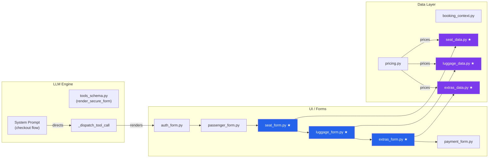
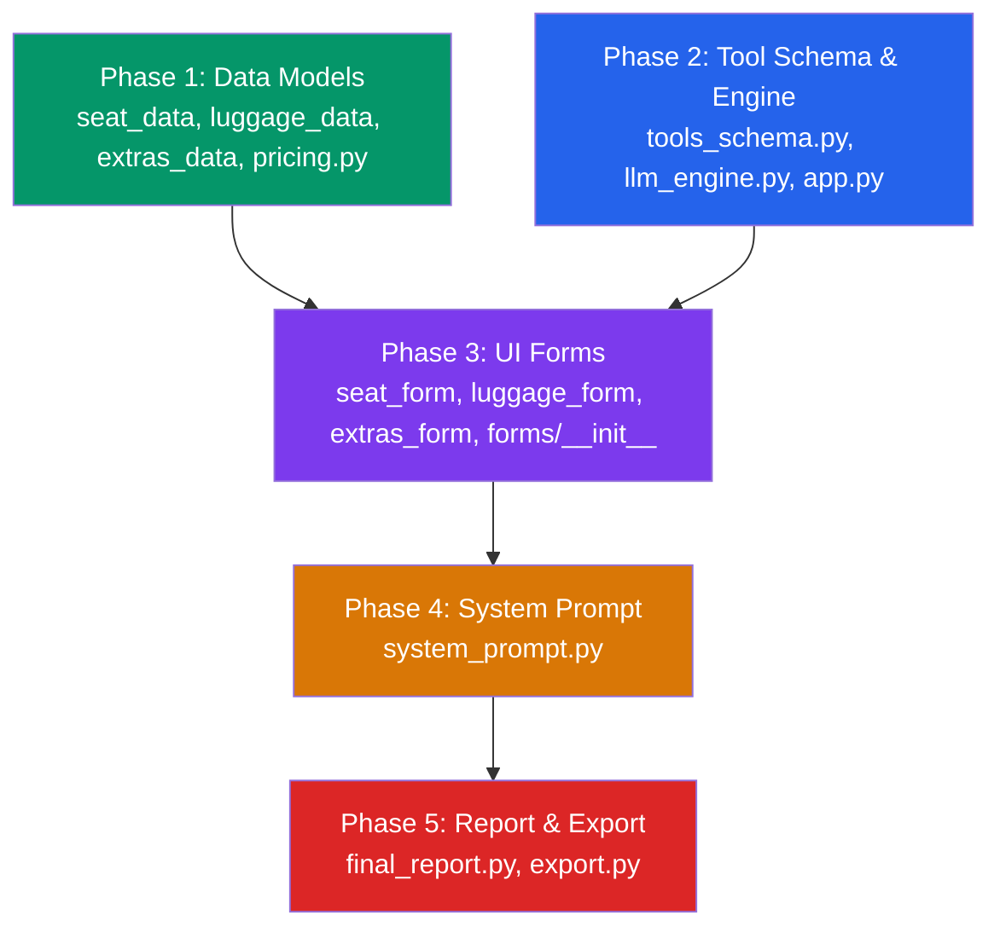

# Implementation Plan: Seat Selection → Luggage → Extra Services

> Extend the checkout pipeline from **3 steps** → **6 steps**, matching the target flow:
>
> **Yer Durumu** → **Yolcu Bilgileri** → **Koltuk Seçimi** → **Bagaj Seçimi** → **Ek Hizmetler** → **Ödeme**
> *(Flight Status → Passenger Info → Seat Selection → Luggage Selection → Extra Services → Payment)*

---

## Current State Analysis

### What We Hold Today

| Step | Form Type | File | Session Key |
|------|-----------|------|-------------|
| 1. Auth | `auth` | [auth_form.py](file:///c:/Users/THALL1/Desktop/airway/UI/forms/auth_form.py) | `user_profile` |
| 2. Passenger Details | `passenger_details` | [passenger_form.py](file:///c:/Users/THALL1/Desktop/airway/UI/forms/passenger_form.py) | `passenger_details` |
| 3. Payment | `payment` | [payment_form.py](file:///c:/Users/THALL1/Desktop/airway/UI/forms/payment_form.py) | `payment_details` |

### What's Missing

| Step | Form Type | New File | Session Key |
|------|-----------|----------|-------------|
| 3. Seat Selection | `seat_selection` | `UI/forms/seat_form.py` | `seat_selections` |
| 4. Luggage | `luggage` | `UI/forms/luggage_form.py` | `luggage_selections` |
| 5. Extra Services | `extras` | `UI/forms/extras_form.py` | `extras_selections` |

### Checkout Sequence (New)

```
auth → passenger_details → seat_selection → luggage → extras → payment
```

---

## Architecture Overview



> ★ = new file

---

## Phase 1 — Data Models & Catalogue ✅

> **Goal**: Define the inventory and pricing for seats, luggage, and extras so the UI has something to render.
>
> **Status**: COMPLETE — adapted from hardcoded dicts to thin wrappers over `thall_lines_db.py` DB functions (`db_get_seat_types`, `db_get_luggage_tiers`, `db_get_extra_services`) since the SQL catalogue tables (`02-ancillary.sql`) were built in a prior session.

### 1.1 New file: `seat_data.py`

Seat map catalogue. Each flight has a cabin layout; seats have a type and a price delta.

```python
# seat_data.py

SEAT_TYPES = {
    "standard":      {"label": "Standard",       "price_tl": 0},
    "extra_legroom":  {"label": "Extra Legroom",   "price_tl": 250},
    "window":        {"label": "Window Preferred", "price_tl": 100},
    "aisle":         {"label": "Aisle Preferred",  "price_tl": 100},
    "emergency_exit": {"label": "Emergency Exit",  "price_tl": 300},
}

def get_available_seats(flight_number: str, ticket_class: str) -> list[dict]:
    """Return the mock seat map for a given flight/class.
    Each entry: {"seat_id": "12A", "type": "extra_legroom", "price_tl": 250, "occupied": False}
    """
    ...

def validate_seat_selection(flight_number: str, seat_id: str) -> dict:
    """Check if a seat is available. Returns {"valid": bool, "error"?: str}."""
    ...
```

### 1.2 New file: `luggage_data.py`

Luggage tiers with price-per-kg or per-bag pricing.

```python
# luggage_data.py

LUGGAGE_TIERS = {
    "cabin_only":   {"label": "Cabin Bag Only (8 kg)",  "included": True,  "price_tl": 0},
    "checked_20kg": {"label": "Checked 20 kg",          "included": False, "price_tl": 350},
    "checked_30kg": {"label": "Checked 30 kg",          "included": False, "price_tl": 550},
    "oversize":     {"label": "Oversize / Sports Gear",  "included": False, "price_tl": 800},
}

def get_luggage_options(ticket_class: str) -> list[dict]:
    """Return available luggage options. Business class includes checked_20kg free."""
    ...
```

### 1.3 New file: `extras_data.py`

Add-on services catalogue.

```python
# extras_data.py

EXTRA_SERVICES = {
    "priority_boarding":   {"label": "Priority Boarding",         "price_tl": 150},
    "lounge_access":       {"label": "Lounge Access",             "price_tl": 400},
    "meal_upgrade":        {"label": "Premium Meal",              "price_tl": 200},
    "travel_insurance":    {"label": "Travel Insurance",          "price_tl": 120},
    "fast_track_security": {"label": "Fast Track Security",       "price_tl": 180},
    "extra_legroom_upgrade": {"label": "Extra Legroom Upgrade",   "price_tl": 300},
}

def get_extras_for_class(ticket_class: str) -> list[dict]:
    """Return available extras. Business class includes some free."""
    ...
```

### 1.4 Extend: `pricing.py`

Add ancillary pricing helpers that the final report can call to produce a complete cost breakdown.

```diff
+# ---------------------------------------------------------------------------
+# Ancillary pricing (seats, luggage, extras)
+# ---------------------------------------------------------------------------
+
+def calculate_ancillary_total(
+    seat_selections: list[dict] | None = None,
+    luggage_selections: list[dict] | None = None,
+    extras_selections: list[dict] | None = None,
+) -> dict:
+    """Compute add-on totals and return a breakdown dict."""
+    seat_total = sum(s.get("price_tl", 0) for s in (seat_selections or []))
+    luggage_total = sum(l.get("price_tl", 0) for l in (luggage_selections or []))
+    extras_total = sum(e.get("price_tl", 0) for e in (extras_selections or []))
+    return {
+        "seat_total_tl": seat_total,
+        "luggage_total_tl": luggage_total,
+        "extras_total_tl": extras_total,
+        "ancillary_total_tl": seat_total + luggage_total + extras_total,
+    }
```

> [!IMPORTANT]
> This integrates into the existing `PRICING_MODIFIERS` open/closed pattern — ancillary costs are additive (not multiplicative on the base fare), so they're computed separately and summed into the grand total at report time.

---

## Phase 2 — Tool Schema & LLM Dispatch ✅

> **Goal**: The LLM needs to be able to trigger the three new forms via `render_secure_form`.
>
> **Status**: COMPLETE — `tools_schema.py` updated with the 6-step flow; `ancillary_data` threaded through `app.py` → `call_llm()` → `_dispatch_tool_call()` to inject selections into the final report.

### 2.1 Modify: [tools_schema.py](file:///c:/Users/THALL1/Desktop/airway/tools_schema.py)

Extend the `render_secure_form` tool's `form_type` enum:

```diff
 "form_type": {
     "type": "string",
-    "enum": ["auth", "passenger_details", "payment"],
-    "description": "Which form to render. Flow is ALWAYS: auth -> passenger_details -> payment."
+    "enum": ["auth", "passenger_details", "seat_selection", "luggage", "extras", "payment"],
+    "description": "Which form to render. Flow is ALWAYS: auth -> passenger_details -> seat_selection -> luggage -> extras -> payment."
 }
```

> [!NOTE]
> No changes needed to `_dispatch_tool_call` in `llm_engine.py` — the `render_secure_form` handler at [L443-456](file:///c:/Users/THALL1/Desktop/airway/llm_engine.py#L443-L456) is already generic. It stores `report_data["render_form"] = form_type` and the UI dispatcher routes based on the string. We just need the dispatcher to recognize the new types.

### 2.2 Modify: [llm_engine.py](file:///c:/Users/THALL1/Desktop/airway/llm_engine.py)

No structural changes to `_dispatch_tool_call` — the existing `render_secure_form` branch is form-type agnostic. However, `generate_final_report` at [L367-397](file:///c:/Users/THALL1/Desktop/airway/llm_engine.py#L367-L397) should include ancillary data in the report:

```diff
 elif function_name == "generate_final_report":
     ...
     report_data = tool_args
     report_data["booked_flights"] = list(flight_data)
+    report_data["seat_selections"] = st_session.get("seat_selections", [])
+    report_data["luggage_selections"] = st_session.get("luggage_selections", [])
+    report_data["extras_selections"] = st_session.get("extras_selections", [])
     flight_data.clear()
```

> [!WARNING]
> `llm_engine.py` is deliberately Streamlit-free. The ancillary session data must be **passed in** from `app.py` rather than imported from `st.session_state`. This means `call_llm()` needs new parameters or `report_data` needs to be pre-populated by `app.py` before the call.

**Preferred approach** — have `app.py` inject the ancillary data into the messages or pre-populate a dict that `_run_llm_turn` passes through. This preserves the engine's framework independence:

```diff
 # app.py – _run_llm_turn()
 def _run_llm_turn():
     result = call_llm(
         client,
         st.session_state.messages,
         st.session_state.flight_data,
         st.session_state.report_data,
+        ancillary_data={
+            "seat_selections": st.session_state.get("seat_selections", []),
+            "luggage_selections": st.session_state.get("luggage_selections", []),
+            "extras_selections": st.session_state.get("extras_selections", []),
+        },
     )
```

```diff
 # llm_engine.py – call_llm()
-def call_llm(client, messages, flight_data, report_data):
+def call_llm(client, messages, flight_data, report_data, ancillary_data=None):
+    ancillary_data = ancillary_data or {}
     ...
```

Then in `generate_final_report` dispatch:

```diff
     report_data["booked_flights"] = list(flight_data)
+    report_data["seat_selections"] = ancillary_data.get("seat_selections", [])
+    report_data["luggage_selections"] = ancillary_data.get("luggage_selections", [])
+    report_data["extras_selections"] = ancillary_data.get("extras_selections", [])
```

---

## Phase 3 — UI Forms ✅

> **Goal**: Build the three new Streamlit form components. Each follows the existing pattern: render inputs → validate on submit → store to `st.session_state.<key>` → set `pending_user_message` → `st.rerun()`.
>
> **Status**: COMPLETE — `seat_form.py`, `luggage_form.py`, and `extras_form.py` created with per-passenger selection, skip buttons, running totals, and data-layer validation. Dispatcher in `forms/__init__.py` updated with all 6 form types.

### 3.1 New file: `UI/forms/seat_form.py`

```python
"""
Render seat selection per passenger.
- Optional: user may skip (random assignment).
- Reads passenger count from flight_data[0].
- Renders a seat map grid or dropdown per passenger.
- Stores to st.session_state.seat_selections.
"""

def render_seat_form() -> None:
    st.markdown("### Secure Checkout: Seat Selection")
    # Read passenger list from st.session_state.passenger_details
    # For each passenger, show available seats (from seat_data.get_available_seats)
    # Allow "Random / No preference" option (free)
    # On submit → validate → store → pending_user_message → rerun
```

**Key design decisions**:
- Seat selection is **per-passenger** — each passenger gets their own seat
- A "Skip / Random Assignment" button should be available (seats are optional per the flow title "Koltuk Seçimi" vs "Yer Durumu")
- Price delta is shown inline per seat type
- Stores a list: `[{"passenger_idx": 0, "seat_id": "12A", "type": "window", "price_tl": 100}, ...]`

### 3.2 New file: `UI/forms/luggage_form.py`

```python
"""
Render luggage selection per passenger.
- Cabin bag is always included.
- Additional checked bags are paid add-ons.
- Business class includes 1 free checked bag.
"""

def render_luggage_form() -> None:
    st.markdown("### Secure Checkout: Luggage")
    # For each passenger, show luggage tier options
    # Business-class passengers get checked_20kg included
    # On submit → validate → store to st.session_state.luggage_selections → rerun
```

**Key design decisions**:
- Per-passenger luggage selection
- Business class passengers see "Checked 20 kg" marked as "Included"
- Multiple bags per passenger supported (add another bag button)
- Stores: `[{"passenger_idx": 0, "tier": "checked_20kg", "price_tl": 350}, ...]`

### 3.3 New file: `UI/forms/extras_form.py`

```python
"""
Render extra services (priority boarding, lounge, meal, insurance, etc.).
- These are per-booking, not per-passenger (except meal).
- Checkboxes with price labels.
"""

def render_extras_form() -> None:
    st.markdown("### Secure Checkout: Extra Services")
    # Show checkbox grid of available extras with prices
    # Business class: some extras included (e.g., priority boarding, lounge)
    # On submit → store to st.session_state.extras_selections → rerun
```

**Key design decisions**:
- Extras are presented as a checkbox list, not per-passenger
- Business-class passengers see some items pre-checked and marked "Included"
- Running total shown at the bottom
- Stores: `[{"service": "lounge_access", "price_tl": 400}, ...]`

### 3.4 Modify: [UI/forms/\_\_init\_\_.py](file:///c:/Users/THALL1/Desktop/airway/UI/forms/__init__.py)

Register the three new form types in the dispatcher:

```diff
 from .auth_form import render_auth_form
 from .passenger_form import render_passenger_form
+from .seat_form import render_seat_form
+from .luggage_form import render_luggage_form
+from .extras_form import render_extras_form
 from .payment_form import render_payment_form


 def render_secure_form_ui(form_type: str):
     if form_type == "auth":
         return render_auth_form()
     elif form_type in ("passenger_details", "passenger"):
         return render_passenger_form()
+    elif form_type in ("seat_selection", "seat"):
+        return render_seat_form()
+    elif form_type == "luggage":
+        return render_luggage_form()
+    elif form_type in ("extras", "extra_services"):
+        return render_extras_form()
     elif form_type == "payment":
         return render_payment_form()
     else:
-        raise ValueError(...)
+        raise ValueError(
+            f"Unsupported form_type: '{form_type}'. "
+            "Expected one of: 'auth', 'passenger_details', 'seat_selection', 'luggage', 'extras', 'payment'."
+        )
```

### 3.5 Modify: [UI/\_\_init\_\_.py](file:///c:/Users/THALL1/Desktop/airway/UI/__init__.py)

No changes required — `render_secure_form_ui` is already the single export, and the new forms are internal to the dispatcher.

---

## Phase 4 — System Prompt ✅

> **Goal**: Rewrite the `[FINAL REPORTING & SECURE CHECKOUT FLOW]` section to instruct the LLM on the full 6-step pipeline.
>
> **Status**: COMPLETE — Updated the checkout sequence in `system_prompt.py` to correctly walk through `seat_selection`, `luggage`, and `extras` before payment, and instructed the LLM to include ancillary costs in the final report.

### 4.1 Modify: [system_prompt.py](file:///c:/Users/THALL1/Desktop/airway/system_prompt.py) — Lines 205–213

```diff
 [FINAL REPORTING & SECURE CHECKOUT FLOW]
 - Do NOT call `generate_final_report` immediately when the user wants to check out.
 - When the user explicitly confirms they are DONE adding flights and want to finalize/check out, you must initiate the checkout pipeline by calling `render_secure_form` in the following sequence:
   1. Call `render_secure_form(form_type="auth")`. Wait for the user to submit it.
   2. Call `render_secure_form(form_type="passenger_details")`. Wait for the user to submit it.
-  3. Call `render_secure_form(form_type="payment")`. Wait for the user to submit it.
+  3. Call `render_secure_form(form_type="seat_selection")`. Wait for the user to submit it.
+     - Seat selection is OPTIONAL. If the user skips, proceed to the next step.
+  4. Call `render_secure_form(form_type="luggage")`. Wait for the user to submit it.
+  5. Call `render_secure_form(form_type="extras")`. Wait for the user to submit it.
+     - Extra services are OPTIONAL. The user may skip without selecting any.
+  6. Call `render_secure_form(form_type="payment")`. Wait for the user to submit it.
 - Never ask the user to type sensitive data (password, credit card, TCKN) in the chat. Rely on the forms.
-- Once the payment form is successfully submitted (you will receive a tool message indicating this), THEN call `generate_final_report` to generate the final receipt and end the chat.
+- Once the payment form is successfully submitted (you will receive a tool message indicating this), THEN call `generate_final_report` to generate the final receipt and end the chat. The final report MUST include ancillary costs (seats, luggage, extras) in the price breakdown.
 - `generate_final_report` returns an itemized price per flight — fare subtotal, tax, and per-passenger fees. Walk the user through that breakdown instead of only quoting the grand total.
```

---

## Phase 5 — Final Report Integration ✅

> **Goal**: The final report should display ancillary selections and their costs.
>
> **Status**: COMPLETE — Updated `UI/final_report.py` and `UI/export.py` to display seat, luggage, and extra services selections and include their costs in the overall total.

### 5.1 Modify: [UI/final_report.py](file:///c:/Users/THALL1/Desktop/airway/UI/final_report.py)

Add sections for seat, luggage, and extras in the rendered report:

```diff
 # After flight breakdown section:
+if report.get("seat_selections"):
+    st.markdown("#### 💺 Seat Selections")
+    for s in report["seat_selections"]:
+        st.markdown(f"- Passenger {s['passenger_idx']+1}: Seat **{s['seat_id']}** ({s['type']}) — {s['price_tl']} TL")
+
+if report.get("luggage_selections"):
+    st.markdown("#### 🧳 Luggage")
+    for l in report["luggage_selections"]:
+        st.markdown(f"- Passenger {l['passenger_idx']+1}: {l['tier']} — {l['price_tl']} TL")
+
+if report.get("extras_selections"):
+    st.markdown("#### ✨ Extra Services")
+    for e in report["extras_selections"]:
+        st.markdown(f"- {e['service']} — {e['price_tl']} TL")
+
+# Grand total should now include ancillary_total
```

### 5.2 Modify: [UI/export.py](file:///c:/Users/THALL1/Desktop/airway/UI/export.py)

The transcript/raw-log exporters should include ancillary data when present.

---

## File Change Summary

| File | Action | Phase |
|------|--------|-------|
| `seat_data.py` | **Create** — seat catalogue & validation | 1 |
| `luggage_data.py` | **Create** — luggage tiers & options | 1 |
| `extras_data.py` | **Create** — extra services catalogue | 1 |
| [pricing.py](file:///c:/Users/THALL1/Desktop/airway/pricing.py) | **Extend** — `calculate_ancillary_total()` | 1 |
| [tools_schema.py](file:///c:/Users/THALL1/Desktop/airway/tools_schema.py#L313-L332) | **Modify** — enum + description in `render_secure_form` | 2 |
| [llm_engine.py](file:///c:/Users/THALL1/Desktop/airway/llm_engine.py#L367-L397) | **Modify** — pass ancillary data into report, new param | 2 |
| [app.py](file:///c:/Users/THALL1/Desktop/airway/app.py#L43-L56) | **Modify** — pass ancillary data to `call_llm()` | 2 |
| `UI/forms/seat_form.py` | **Create** — seat selection form | 3 |
| `UI/forms/luggage_form.py` | **Create** — luggage selection form | 3 |
| `UI/forms/extras_form.py` | **Create** — extras selection form | 3 |
| [UI/forms/\_\_init\_\_.py](file:///c:/Users/THALL1/Desktop/airway/UI/forms/__init__.py) | **Modify** — register 3 new form types | 3 |
| [system_prompt.py](file:///c:/Users/THALL1/Desktop/airway/system_prompt.py#L205-L213) | **Modify** — 6-step checkout instructions | 4 |
| [UI/final_report.py](file:///c:/Users/THALL1/Desktop/airway/UI/final_report.py) | **Modify** — render ancillary in report | 5 |
| [UI/export.py](file:///c:/Users/THALL1/Desktop/airway/UI/export.py) | **Modify** — include ancillary in exports | 5 |
| `booking_context.py` | **No changes** — date/time context is unrelated | — |
| `payment.py` | **No changes** — payment gateway is unchanged | — |

---

## Dependency Order



> Phases 1 and 2 can be done **in parallel**. Phase 3 depends on both. Phase 4 and 5 are sequential after 3.

---

## Key Design Decisions to Confirm

> [!IMPORTANT]
> The following decisions affect scope and should be confirmed before implementation:

1. **Seat selection granularity** — Should we render a visual seat map grid (rows × columns) or a simpler dropdown per passenger? A grid is more realistic but significantly more UI work.

2. **Per-passenger vs per-booking extras** — Are extra services like lounge access purchased per-passenger or per-booking? (e.g., does each traveler need their own lounge pass, or is it one for the group?)

3. **Luggage multipliers** — Should luggage pricing vary by route distance or ticket class, or stay flat?

4. **Skip behavior** — When the user clicks "Skip" on seat selection or extras, should the LLM acknowledge it conversationally, or silently advance to the next form?

5. **Business-class inclusions** — Which extras/luggage are complimentary for Business class? This affects both `luggage_data.py` and `extras_data.py` logic.
