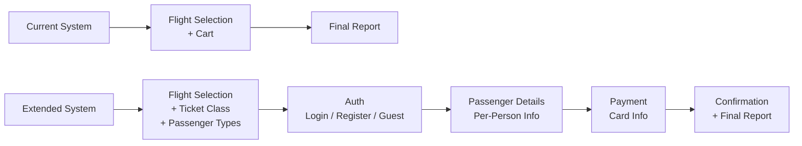

# Workflow Extension Plan — Full Booking Pipeline
_Created: 2026-08-11_

This document outlines the architecture for extending the Thall Lines chatbot from a **flight selection** tool into a **complete booking pipeline** covering ticket classes, passenger details, authentication, and payment.

---

## Current vs. Extended Flow



---

## Phase 1 — Enriched Flight Selection

> [!IMPORTANT]
> These changes affect: `system_prompt.py`, `tools_schema.py`, `llm_engine.py`, `thall_lines_db.py`

### 1.1 New Fields to Collect (Per Flight)

| Field | Values | Current Status |
|---|---|---|
| Trip Type | One-way, Round-trip, **Multi-city** | ⚠️ Multi-city missing |
| From / To | IATA codes | ✅ Exists |
| Departure Date(s) | YYYY-MM-DD (2+ for multi-city) | ⚠️ Only supports 1-2 |
| Passenger Count | 1–9 total | ✅ Exists |
| **Ticket Class** | Economy, Business | ❌ New |
| **Passenger Types** | Adult (12+), Child (2–12), Baby (0–2) | ❌ New |

### 1.2 Database Changes (`thall_lines_db.py`)

**Pricing model update:**
- Each flight currently has a single `base_price_tl`. We need to add class-based and age-based pricing.
- Suggested approach — add multipliers rather than duplicating every price:

```python
# New constants at module level
TICKET_CLASS_MULTIPLIER = {
    "Economy":  1.0,
    "Business": 2.5,
}

PASSENGER_TYPE_MULTIPLIER = {
    "Adult":  1.0,    # 12+
    "Child":  0.70,   # 2–12 (30% discount)
    "Baby":   0.10,   # 0–2  (90% discount, lap seat)
}
```

**`calculate_total_price` update:**
```python
def calculate_total_price(outbound, passengers_breakdown, trip_type, 
                          ticket_class, inbound=None):
    """
    passengers_breakdown: {"adult": 2, "child": 1, "baby": 0}
    ticket_class: "Economy" | "Business"
    """
    base = outbound["base_price_tl"]
    class_mult = TICKET_CLASS_MULTIPLIER[ticket_class]
    legs = 2 if trip_type == "Round-trip" else 1
    
    total = 0
    for ptype, count in passengers_breakdown.items():
        total += base * class_mult * PASSENGER_TYPE_MULTIPLIER[ptype] * count
    
    return round(total * legs, 2)
```

### 1.3 Tool Schema Changes (`tools_schema.py`)

**`generate_flight_widget`** — add new required parameters:

```python
"ticket_class": {
    "type": "string",
    "enum": ["Economy", "Business"],
    "description": "Ticket class selected by the user."
},
"adult_count": {
    "type": "integer",
    "description": "Number of adult passengers (age 12+)."
},
"child_count": {
    "type": "integer",
    "description": "Number of child passengers (age 2-12)."
},
"baby_count": {
    "type": "integer",
    "description": "Number of baby passengers (age 0-2)."
}
```

### 1.4 System Prompt Changes

Update `[THE BOOKING SEQUENCE — PER FLIGHT]` to:

```
1. Trip Type (One-way, Round-trip, or Multi-city)
2. Departure Location (From)
3. Arrival Location (To)
4. Departure Date (+ additional dates if multi-city)
5. Return Date (if Round-trip)
6. Ticket Class (Economy or Business)
7. Passenger Breakdown (how many adults, children, babies)
8. Availability Check
```

---

## Phase 2 — Authentication Gate

> [!IMPORTANT]
> This is the first step AFTER the user clicks "Checkout". It happens between cart and passenger details.

### 2.1 Architecture Decision: Chat vs. UI Forms?

| Approach | Pros | Cons |
|---|---|---|
| **A) LLM collects everything conversationally** | No new UI code. Works within existing chat paradigm. | Painful for structured data (card numbers, TCKNs). Error-prone. |
| **B) Hybrid: LLM handles flow control, Streamlit forms handle structured input** | Clean UX for forms. LLM still orchestrates the conversation. | More complex. Requires new UI components and session state management. |
| **C) Full Streamlit forms (no LLM for checkout)** | Most reliable data capture. | Breaks the conversational feel. Two different UX paradigms. |

> [!WARNING]
> **Recommendation:** Approach **B (Hybrid)** is the strongest. The LLM asks "would you like to log in, register, or continue as guest?" conversationally, but the actual data entry (TCKN, card number, etc.) is done via secure Streamlit form widgets — not typed into a chat box where they'd be stored in conversation history and potentially leaked via transcript exports.

### 2.2 Auth Flow

```
User clicks "Checkout" →
  LLM asks: "Want to log in, register, or continue as a guest?"
  
  → Login:    LLM calls `authenticate_user` tool → pulls saved profile
  → Register: LLM calls `register_user` tool → creates new profile
  → Guest:    Skip to passenger details (no profile saved)
```

### 2.3 New Data Structures (`thall_lines_db.py`)

```python
USERS: list[dict] = [
    {
        "user_id": 1,
        "email": "ahmet@example.com",
        "password_hash": "mock_hashed_pw",  # Never real in a mock
        "name": "Ahmet",
        "surname": "Yılmaz",
        "birthdate": "1990-05-14",
        "sex": "M",
        "nationality": "TR",
        "tckn": "12345678901",  # 11-digit Turkish ID
        "mobile": "+905551234567",
    },
    # ... more mock users
]
```

### 2.4 New Tools (`tools_schema.py`)

```python
authenticate_user_tool = [{
    "type": "function",
    "function": {
        "name": "authenticate_user",
        "description": "Log in an existing user by email. Returns their saved profile data.",
        "parameters": {
            "type": "object",
            "properties": {
                "email": {"type": "string"},
                "password": {"type": "string"}
            },
            "required": ["email", "password"]
        }
    }
}]
```

---

## Phase 3 — Passenger Details

> [!IMPORTANT]
> Collected AFTER auth, BEFORE payment. One entry per passenger.

### 3.1 Required Fields Per Passenger

| Field | Type | Condition |
|---|---|---|
| Name | string | Always |
| Surname | string | Always |
| Birthdate | YYYY-MM-DD | Always |
| Sex | M / F | Always |
| Nationality | ISO 2-letter code | Always |
| TCKN | 11-digit string | Only if nationality == "TR" |
| Mobile | string | Always |
| Email | string | Always |

### 3.2 Implementation Approach (Hybrid)

When the LLM reaches the passenger details phase:

1. **If logged in:** Auto-fill the first passenger from the user's profile. LLM confirms: *"I've pre-filled your info from your account. Correct?"*
2. **For additional passengers:** The LLM triggers a new tool `collect_passenger_info` which renders a Streamlit form in the sidebar or main area.
3. **Baby validation:** If `baby_count > 0`, the system must ensure at least one adult per baby (airline regulation).

### 3.3 New Tool

```python
collect_passenger_info_tool = [{
    "type": "function",
    "function": {
        "name": "collect_passenger_info",
        "description": "Render a passenger information form for the user to fill in.",
        "parameters": {
            "type": "object",
            "properties": {
                "passenger_index": {"type": "integer"},
                "passenger_type": {"type": "string", "enum": ["Adult", "Child", "Baby"]},
                "prefill_from_account": {"type": "boolean"}
            },
            "required": ["passenger_index", "passenger_type"]
        }
    }
}]
```

---

## Phase 4 — Payment

> [!WARNING]
> Card data should NEVER be collected via chat messages. It must use a secure Streamlit form widget that does NOT persist in `st.session_state.messages`.

### 4.1 Required Fields

| Field | Type |
|---|---|
| Cardholder Name | string |
| Cardholder Surname | string |
| Email | string |
| Card Number | 16-digit string |
| Expiry Date | MM/YY |
| CVC | 3-digit string |

### 4.2 Implementation

1. LLM calls `initiate_payment` tool → triggers a Streamlit form overlay.
2. User fills in the form and clicks "Pay".
3. The form handler validates the card (Luhn check on card number, expiry not in past, CVC is 3 digits).
4. On success → LLM calls `generate_final_report` with enriched data.
5. On failure → error message, re-render form.

### 4.3 Mock Validation (`thall_lines_db.py`)

```python
def validate_card(card_no: str, exp: str, cvc: str) -> dict:
    """Mock card validation. In production, this calls a payment gateway."""
    if len(card_no.replace(" ", "")) != 16:
        return {"valid": False, "error": "Card number must be 16 digits."}
    if len(cvc) != 3:
        return {"valid": False, "error": "CVC must be 3 digits."}
    # Mock: always approve
    return {"valid": True, "transaction_id": "TXN-MOCK-" + card_no[-4:]}
```

---

## Implementation Order

| Step | Scope | Files Touched | Complexity |
|---|---|---|---|
| **1** | Ticket class + passenger types | `thall_lines_db.py`, `tools_schema.py`, `llm_engine.py`, `system_prompt.py` | Medium |
| **2** | Multi-city trip type support | `system_prompt.py`, `tools_schema.py`, `llm_engine.py` | Medium |
| **3** | Auth gate (login/register/guest) | `thall_lines_db.py`, `tools_schema.py`, `llm_engine.py`, `app.py`, `system_prompt.py` | High |
| **4** | Passenger details collection | `ui_components.py`, `app.py`, `tools_schema.py`, `llm_engine.py` | High |
| **5** | Payment form + mock validation | `ui_components.py`, `app.py`, `thall_lines_db.py`, `tools_schema.py`, `llm_engine.py` | High |
| **6** | Workflow diagram updates | `workflow_diagrams.md` | Low |
| **7** | System prompt overhaul | `system_prompt.py` | Medium |

---

## Open Questions for You

1. **Multi-city:** Should multi-city be a separate trip type in the tool schema, or should we handle it as "the user adds multiple one-way flights to the cart" (which already works)?
2. **Auth persistence:** Should login state persist across Streamlit reruns (using `st.session_state`), or should we use cookies/local storage for true persistence?
3. **Payment security:** Since this is a mock/demo system, are you okay with the card form being a standard Streamlit form, or do you want to simulate a redirect to an external payment page (like real airlines do with 3D Secure)?
4. **Baby pricing:** Is 10% of base fare for babies (lap seat, no luggage) the right multiplier, or do you have a different figure in mind?
5. **TCKN validation:** Should we implement the actual Turkish ID checksum algorithm, or just validate that it's 11 digits?
